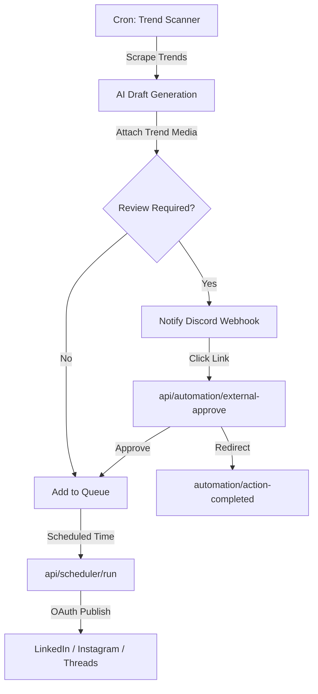

# PostSync Content Automation Guide

The PostSync Automation Engine automatically discovers hot industry trends, drafts high-performing social updates tailored to your brand voice, and publishes them natively to your channels.

---

## 1. Engine Workflow

---

## 2. Configuration Settings

Inside the **Automation Dashboard**, you can configure:

### General Toggle
*   **Active / Paused:** Enable or suspend the automation pipeline.

### Schedule Settings
*   **Time & Days:** Define the local times (converted to UTC for scheduling) and days (e.g., Weekdays only) when automated posts should be generated and scheduled.
*   **Frequency:** Daily, Weekly, or Monthly.

### Brand Voice Calibration
*   **Tone of Voice:** (e.g. Professional, Informative, Casual, Bold).
*   **Formatting Rules:** Enforce rules like character limits, first-comment hashtags, list styles, and emoji density.
*   **Keywords & Curated Topics:** Filter trend scans using explicit keywords related to your niche.

### Review Pipeline
*   **Approval Loop:** When checked, posts are generated as drafts (`status: pending`) and require confirmation. When unchecked, posts bypass review and go straight into the queue.
*   **Notification Targets:** Set up Discord webhook endpoints to dispatch review notices.

---

## 3. Review Webhook Handshake

1.  When a draft is generated, an outgoing payload is sent to Discord:
    *   Contains the adapted post caption and destination platforms.
    *   Provides two tokenized action URLs: **Approve** and **Reject**.
2.  Clicking **Approve** makes an API call to `/api/automation/external-approve?action=approve&token=<jwt>`.
3.  The route verifies the JWT token signature (to prevent spoofing) and updates the draft status to `approved` (and schedules it).
4.  The reviewer is redirected to `/automation/action-completed`, which displays a premium light-themed card showing confirmation of the action.
